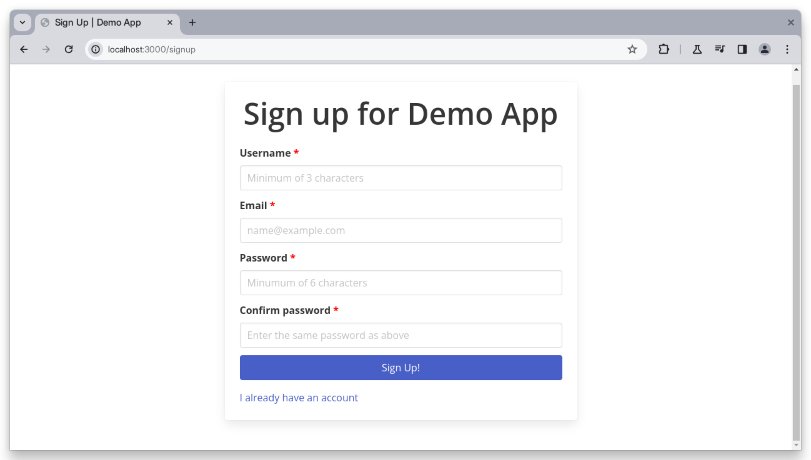

# Load testing with Artillery

This repository hosts a demo application with login functionality, specifically designed to showcase load testing using Artillery.

**Tutorial**: [Link to corresponding BetterStack tutorial]()



## 🟢 Prerequisites

- Basic JavaScript knowledge.
- A working [Node.js environement](https://nodejs.org/en/download).

## 📦 Getting started

- Clone this repo to your machine:

```bash
git clone https://github.com/<your_username>/playwright-signup-login
```

- Install the dependencies:

```bash
cd playwright-signup-login && npm install
```

- Start the development server:

```bash
npm start
```

- You can see the application at http://localhost:3000.

- [Follow the tutorial](/)
  to learn more.

## ⚖ License

The code used in this project and in the linked tutorial are licensed under the
[Apache License, Version 2.0](LICENSE)
